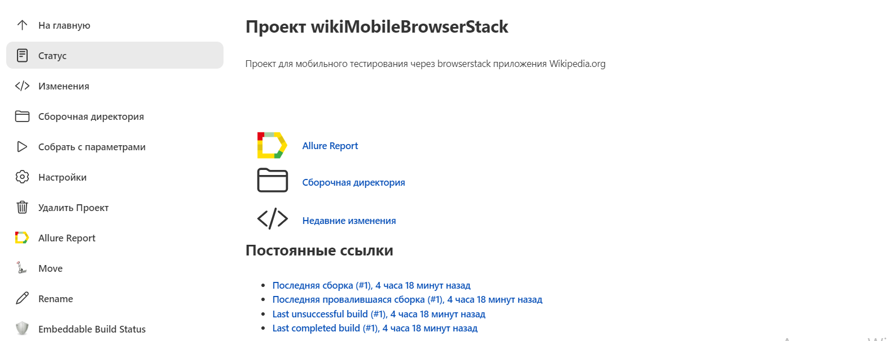
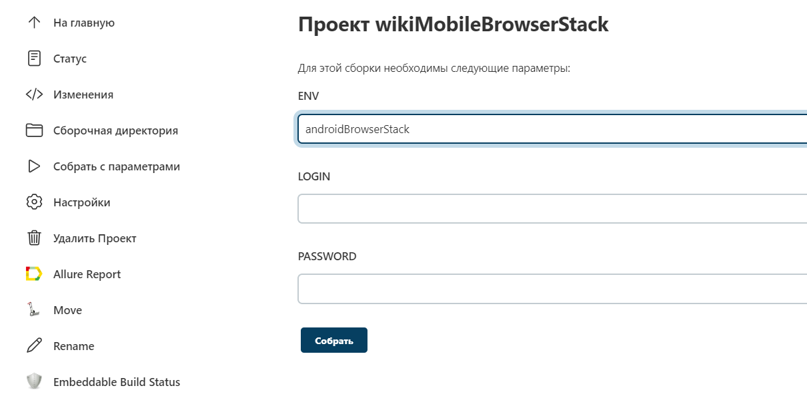

## Учебный проект по автоматизации тестирования (mobile)

##  Содержание

- Технологии и инструменты
- Список проверок, реализованных в тестах
- Запуск тестов (сборка в Jenkins)
- Allure-отчет

## Технологии и инструменты

Список проверок, реализованных в автотестах

- [x] Тест на поиск статей по слову
- [x] Тест на отмену поиска
- [x] Тест на сравнение заголовка найденной статьи  в поиске и при открытии
- [x] Тест на добавление статьи в сохраненный список

## Запуск тестов

###  Локальный запуск на эмуляторе:
1. Запуск с командной строки: 
gradle clean test -Denv=androidLocal
2. Получение отчёта: gradle allureServe

###  Настройка Jenkins и удаленный запуск в Browserstack:
1. Открыть <a target="_blank" href="https://jenkins.autotests.cloud/job/wikiMobileBrowserStack">проект</a>

2. Выбрать пункт **Собрать с параметрами**
3. В поля LOGIN и PASSWORD ввести логин и пароль

4. Нажать **Собрать**
5. Результат запуска сборки можно посмотреть в отчёте Allure

## </a> Отчет в <a target="_blank" href="https://jenkins.autotests.cloud/job/C16-NazilyaMullagildina_mobile-tests/10/allure/">Allure report</a>

[Вернуться к оглавлению ⬆](#Ссылка)
